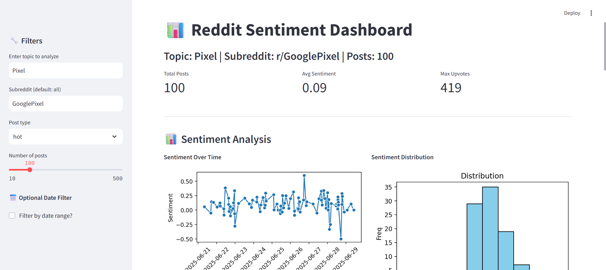
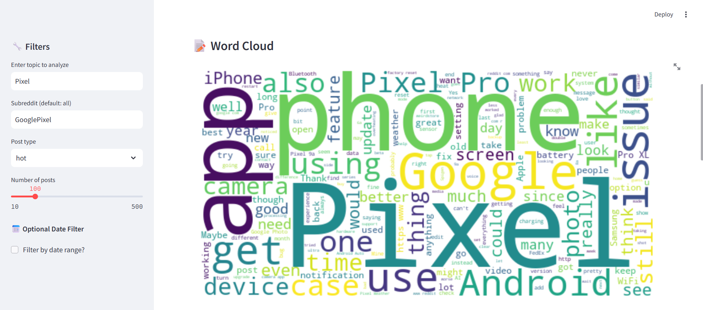
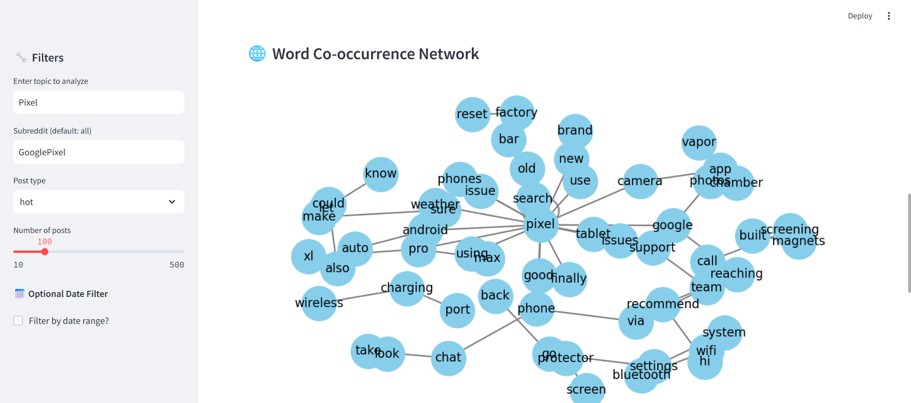
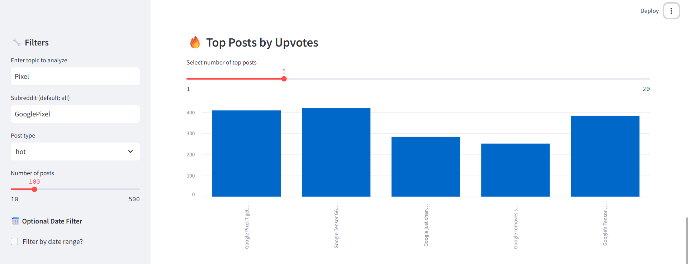
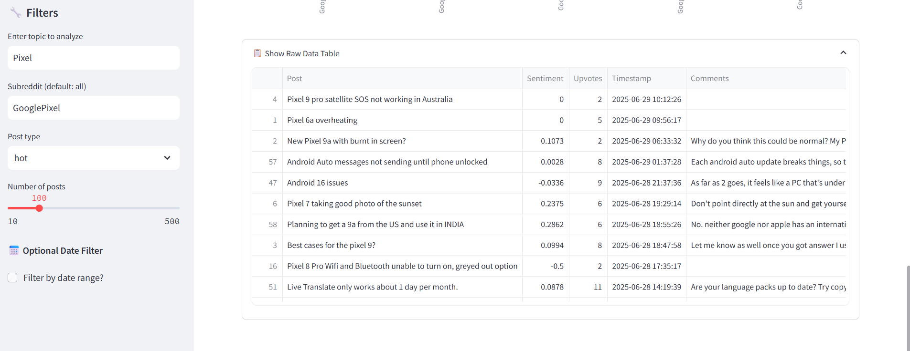

# 📊 Reddit Sentiment Dashboard

An interactive Streamlit dashboard that visualizes Reddit discussions around any topic using sentiment analysis, word clouds, and network graphs. Perfect for researchers, marketers, and enthusiasts looking to explore social trends and opinions on Reddit.

---

## 🚀 Features

- 🔎 Search by topic and subreddit
- 🧵 Choose post type: hot / new / top
- 📅 Optional date range filter
- 📈 Visualize sentiment over time
- 📊 View sentiment distribution
- 📝 Generate word clouds from posts + comments
- 🌐 Co-occurrence word network graph
- 🔥 Explore top upvoted posts
- 📋 Raw data table with all extracted posts

---

## 📷 Screenshots

### Dashboard Overview


### Word Cloud


### Network Graph


### Votes 


### Data Graph


---

## 🛠 Installation

### 1. Clone the repo:
```bash
git clone https://github.com/YOUR_USERNAME/reddit-dashboard.git
cd reddit-dashboard
